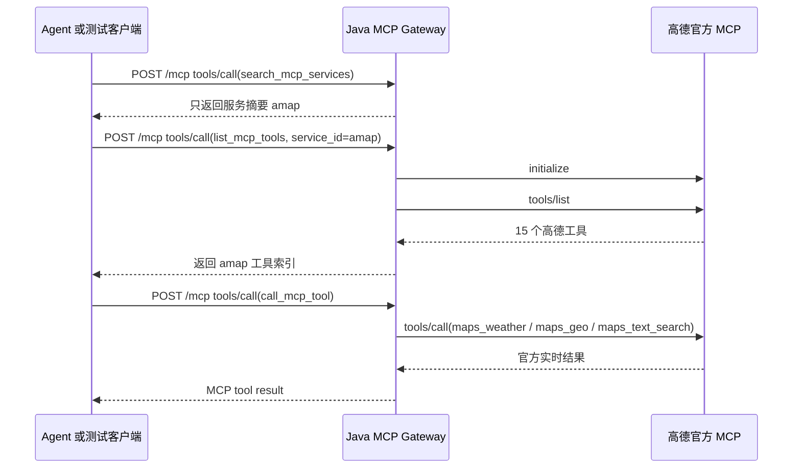

# 高德地图真实远程 MCP 验证说明

本文记录本阶段将高德地图官方 MCP Server 接入 `java-mcp-gateway` 的改动和验证结果。高德 Key 属于敏感凭证，当前实现不再依赖启动前环境变量，而是由用户通过 Gateway catalog tool 提交，并加密保存到本机。

## 接入目标

本阶段目标是验证网关可以接入真实可用的远程 Streamable HTTP MCP 服务，而不是本地 stdio 服务或模拟服务。调用链路为：



## 代码改动

### `McpServiceCatalogProperties`

新增 `url` 配置字段，用于描述远程 Streamable HTTP MCP endpoint。这样 `application-real-mcp.yml` 可以声明 HTTP MCP 服务，不再只能声明 stdio 服务。

### `GatewayConfiguration`

`registerConfiguredServices` 现在支持两类 transport：

- `stdio`：沿用已有本地进程 MCP client。
- `streamable-http`：注册 `StreamableHttpMcpClient`，并把服务写入 `GatewayRuntime` 的服务目录。

### `StreamableHttpMcpClient`

原实现只用于本地 Feishu mock，`listTools()` 返回预置工具。现在新增真实远程 MCP 流程：

- 首次请求前发送 `initialize`。
- `listTools()` 调用远程 `tools/list` 并解析工具名、描述和简化后的输入 schema。
- `callTool()` 调用远程 `tools/call`，并提取 MCP content 中的 text。
- 请求头增加 `Accept: application/json, text/event-stream`，兼容 Streamable HTTP 服务常见返回类型。

当前实现已能验证高德官方 JSON 响应型 Streamable HTTP MCP。完整生产化还需要继续补强 SSE/event-stream 分片解析、session header 管理、连接池、超时/重试/熔断等能力。

### `application-real-mcp.yml`

新增服务：

```yaml
- id: amap
  name: AMap MCP
  transport: streamable-http
  url: https://mcp.amap.com/mcp?key={api_key}
  requiresUserCredential: true
  credentialRequirements:
    - name: api_key
      description: 高德开放平台 Web 服务 Key
      secret: true
```

启动 Gateway 时不需要提供高德 Key：

```bash
mvn spring-boot:run -Dspring-boot.run.profiles=real-mcp -Dspring-boot.run.arguments=--server.port=8091
```

用户通过 Cursor 或 curl 提交凭证：

```bash
curl -s http://127.0.0.1:8091/mcp \
  -H 'Content-Type: application/json' \
  -H 'Authorization: Bearer alice' \
  -d '{"jsonrpc":"2.0","id":"submit","method":"tools/call","params":{"name":"submit_mcp_credential","arguments":{"service_id":"amap","credential_type":"api_key","credential_value":"你的高德Key"}}}'

curl -s http://127.0.0.1:8091/mcp \
  -H 'Content-Type: application/json' \
  -H 'Authorization: Bearer alice' \
  -d '{"jsonrpc":"2.0","id":"refresh","method":"tools/call","params":{"name":"refresh_mcp_service","arguments":{"service_id":"amap"}}}'
```

### `McpGatewayController`

默认测试用户 `alice` 增加：

- `mcp:amap:discover`
- `mcp:amap:use`
- `mcp:amap:*`

用于本地验证高德服务发现、工具列表和工具调用。

### `StreamableHttpMcpClientTest`

新增单元测试，使用 `MockRestServiceServer` 验证真实 HTTP MCP client 的核心顺序：

1. `initialize`
2. `tools/list`
3. `tools/call`

## 验证结果

### 1. 高德官方端点直连验证

官方文档给出的远程入口为：

```text
https://mcp.amap.com/mcp?key=...
```

直连 `initialize` 返回：

- `protocolVersion`: `2025-03-26`
- `serverInfo.name`: `amap-sse-server`
- `capabilities.tools.listChanged`: `false`

直连 `tools/list` 返回 15 个工具，包括：

- `maps_weather`
- `maps_geo`
- `maps_text_search`
- `maps_direction_driving`
- `maps_direction_walking`
- `maps_distance`
- `maps_regeocode`
- `maps_schema_navi`
- `maps_schema_take_taxi`

### 2. Maven 测试

执行：

```bash
mvn test
```

结果：

```text
Tests run: 13, Failures: 0, Errors: 0, Skipped: 0
BUILD SUCCESS
```

### 3. 网关服务发现

请求：

```bash
curl -s http://127.0.0.1:8091/mcp \
  -H 'Content-Type: application/json' \
  -H 'Authorization: Bearer alice' \
  -d '{"jsonrpc":"2.0","id":"search-amap","method":"tools/call","params":{"name":"search_mcp_services","arguments":{"query":"高德"}}}'
```

结果要点：

- 返回 `ServiceSummary[id=amap, name=AMap MCP, ...]`
- `toolCount=15`
- `available=true`

### 4. 网关工具列表

请求 `list_mcp_tools(service_id=amap)` 后，网关返回高德 15 个工具，说明能力索引来自远程 `tools/list`。

### 5. 网关真实工具调用

已通过网关验证以下真实高德工具：

- `maps_weather`：查询北京天气，返回 2026-05-29 起的天气预报。
- `maps_geo`：解析北京市朝阳区阜通东大街 6 号，返回经纬度和行政区信息。
- `maps_text_search`：搜索上海咖啡 POI，返回多个真实地点结果。

## 当前完整性判断

从“真实远程 MCP 调用链路”角度，本阶段已验证完整：

- 网关可以注册远程 Streamable HTTP MCP 服务。
- Agent 侧仍然只看到 gateway catalog tools，不会一次暴露高德 15 个工具。
- Agent 可以按需发现 `amap` 服务。
- 网关可以通过远程 `tools/list` 建立能力索引。
- 网关可以通过远程 `tools/call` 转发到高德官方 MCP 并拿到真实结果。

从“生产可用”角度，还不是完整版本，后续至少需要补：

- 完整 Streamable HTTP event-stream 解析。
- MCP session header 管理。
- Key 不放 URL query，改为凭证管理模块注入。
- HTTP 连接池、超时、重试、熔断、限流。
- 按租户、用户、服务、工具维度的授权策略。
- 远程服务健康检查和动态能力刷新。
