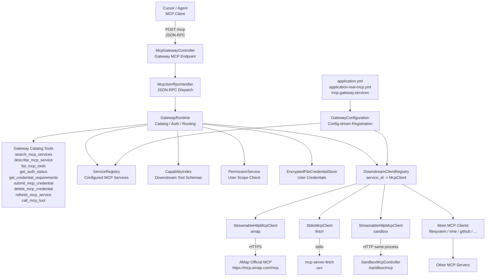
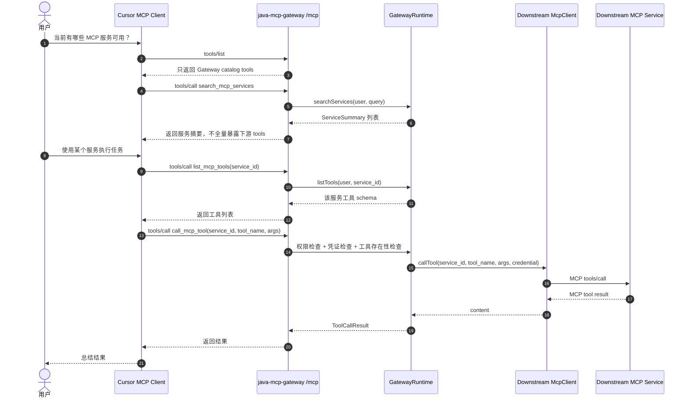
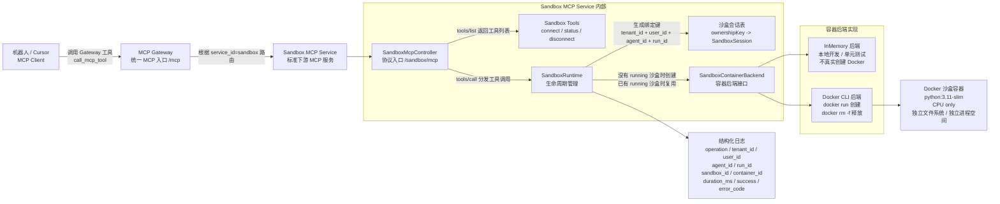
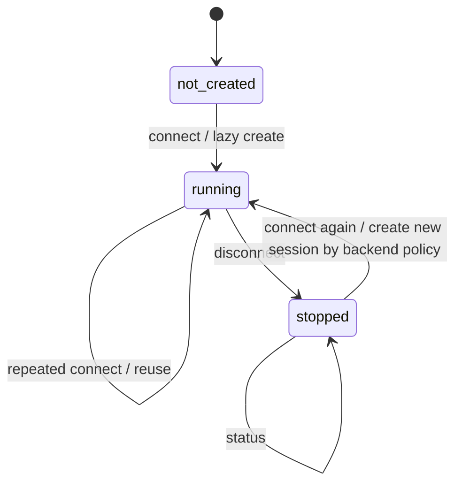
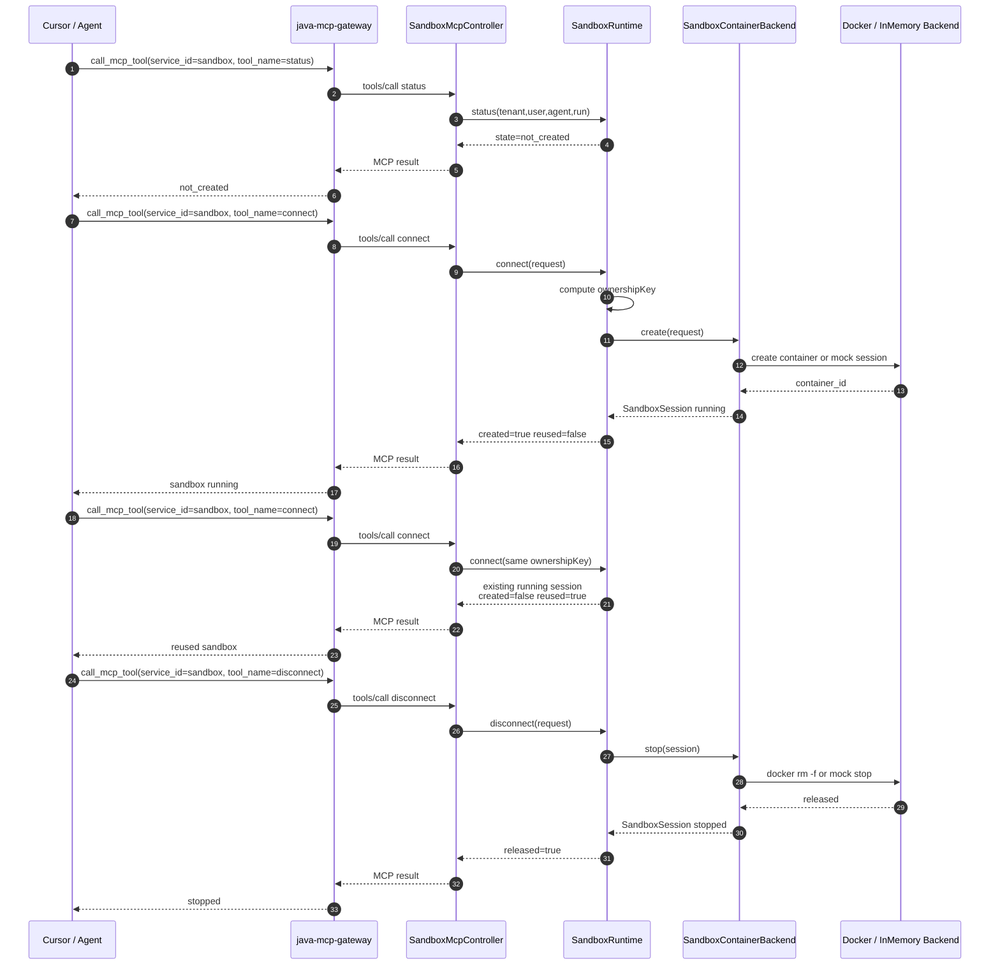

# MCP Gateway 架构设计图与 Sandbox 实现说明

## 1. 关于 Visio

当前 Codex 环境不能直接调用本机 Visio 应用生成 `.vsdx` 文件。本文件使用 Mermaid 绘制架构图，优点是：

- 可以直接随代码提交，便于 mentor review。
- Git diff 可读，后续容易维护。
- 可以复制到 Mermaid Live Editor、语雀、飞书文档、draw.io 等工具中渲染。
- 如果必须交付 Visio，可先用 draw.io 导入 Mermaid 或手工复刻，再导出为 Visio 支持的格式。

## 2. 总体定位

`java-mcp-gateway` 当前定位是 Agent/Cursor 与多个下游 MCP 服务之间的统一入口。

对上游 Cursor/Agent 来说：

```text
java-mcp-gateway = 一个 MCP Server
```

对下游 MCP 服务来说：

```text
java-mcp-gateway = MCP Client + Router + Catalog
```

核心设计目标：

1. Cursor/Agent 只挂载一个 Gateway。
2. Gateway 顶层只暴露少量 catalog tools，避免下游 tools 全量暴露导致上下文膨胀。
3. 下游 MCP 服务统一通过配置注册，避免代码硬编码。
4. Gateway 负责服务发现、能力索引、权限检查、凭证检查和路由转发。
5. Sandbox 作为一个标准下游 MCP Service 接入，而不是写死在 Gateway 路由里。

## 3. MCP Gateway 总体架构图



## 4. 服务注册设计

当前服务注册已经统一收敛到配置：

```yaml
mcp:
  gateway:
    services:
      - id: sandbox
        name: Sandbox MCP
        description: Manage isolated Docker sandboxes for agent runs
        tags: [sandbox, docker, runtime, agent, 沙盒, 隔离]
        transport: streamable-http
        url: /sandbox/mcp
        timeoutMs: 30000
        requiresUserCredential: false
        bootstrapTools: sandbox
```

关键点：

| 字段 | 说明 |
| --- | --- |
| `id` | Gateway 内部唯一服务 ID，例如 `amap`、`fetch`、`sandbox` |
| `transport` | 下游连接方式，目前支持 `streamable-http` 和 `stdio` |
| `url` | HTTP MCP endpoint，适用于远程 MCP 或本地 HTTP MCP |
| `command` / `args` | stdio MCP 启动命令 |
| `requiresUserCredential` | 是否需要用户凭证 |
| `credentialRequirements` | 该服务需要哪些凭证字段 |
| `enabled` | 是否启用该服务 |
| `bootstrapTools` | 本地同进程服务启动时的工具 schema 提供器 |

`bootstrapTools` 不是服务注册来源，只是给 `feishu` mock 和 `sandbox` 这类本地同进程服务提供启动期工具 schema，避免 Gateway 启动索引时依赖 HTTP 自调用。

以后新增 MCP 服务时，主流程不需要改 Java 代码，优先只新增 YAML 配置。

## 5. Cursor 调用链路图



## 6. Sandbox MCP Service 定位

Sandbox 不是 Gateway 内部的特殊逻辑，而是一个标准 MCP Service：

```text
service_id = sandbox
endpoint = /sandbox/mcp
transport = streamable-http
```

Gateway 只负责：

1. 通过配置发现 `sandbox` 服务。
2. 索引 `sandbox` 的 tools。
3. 接收 Cursor/Agent 的 `call_mcp_tool`。
4. 转发到 `/sandbox/mcp`。
5. 把 Sandbox MCP 的结果返回给 Cursor/Agent。

真正的沙盒生命周期逻辑在 Sandbox MCP Service 内部完成。

## 7. Sandbox 功能架构图



这张图要表达的核心是：

- 机器人不直接操作 Docker。
- 机器人只通过 Gateway 调用 `sandbox` 这个 MCP 服务。
- Gateway 不负责创建容器，只负责服务发现、权限、路由转发。
- Sandbox MCP Service 内部提供 `connect`、`status`、`disconnect` 三个工具。
- `SandboxRuntime` 使用 `tenant_id + user_id + agent_id + run_id` 绑定一个独立 sandbox。
- 容器创建细节被抽象到 `SandboxContainerBackend`，第一版可以用 in-memory 验证，也可以切到 Docker CLI。

## 8. Sandbox 工具列表

第一版只提供三个工具：

| Tool | 说明 |
| --- | --- |
| `connect` | 为一个 Agent Run 创建或复用 sandbox |
| `status` | 查询一个 Agent Run 当前 sandbox 状态 |
| `disconnect` | 停止并释放一个 Agent Run 绑定的 sandbox |

### 8.1 connect

输入：

```json
{
  "tenant_id": "default",
  "user_id": "alice",
  "agent_id": "agent-001",
  "run_id": "run-001",
  "profile": "cpu-python",
  "ttl_seconds": 3600
}
```

行为：

1. 生成 ownership key：

```text
tenant_id + user_id + agent_id + run_id
```

2. 查找是否已有 sandbox session。
3. 如果已有且状态为 `running`，返回复用结果：

```text
created=false
reused=true
```

4. 如果没有，则根据 profile 创建新的 sandbox。
5. 保存 ownership key 到 `SandboxSession` 的绑定。
6. 返回 sandbox 信息。

输出示例：

```json
{
  "sandbox_id": "sbx_1",
  "container_id": "docker_1",
  "state": "running",
  "created": true,
  "reused": false,
  "workspace": "/workspace/sbx_1",
  "profile": "cpu-python",
  "image": "python:3.11-slim"
}
```

### 8.2 status

输入：

```json
{
  "tenant_id": "default",
  "user_id": "alice",
  "agent_id": "agent-001",
  "run_id": "run-001"
}
```

connect 前输出：

```json
{
  "sandbox_id": null,
  "state": "not_created"
}
```

connect 后输出：

```json
{
  "sandbox_id": "sbx_1",
  "container_id": "docker_1",
  "state": "running",
  "workspace": "/workspace/sbx_1",
  "profile": "cpu-python",
  "image": "python:3.11-slim"
}
```

### 8.3 disconnect

输入：

```json
{
  "tenant_id": "default",
  "user_id": "alice",
  "agent_id": "agent-001",
  "run_id": "run-001"
}
```

行为：

1. 根据 ownership key 查找 sandbox。
2. 如果不存在，返回 `not_created`。
3. 如果存在，调用后端停止/释放 container。
4. 将 session 状态更新为 `stopped`。
5. 返回释放结果。

输出示例：

```json
{
  "sandbox_id": "sbx_1",
  "container_id": "docker_1",
  "state": "stopped",
  "disconnected": true,
  "released": true
}
```

## 9. Sandbox 生命周期图



当前实现中：

- `status` 不会创建 sandbox。
- 第一次 `connect` 才会 lazy create。
- 同一个 ownership key 重复 `connect` 会复用 running sandbox。
- 不同 `run_id` 会创建不同 sandbox。
- `disconnect` 后状态保留为 `stopped`，便于查询最终状态。

## 10. Agent Run 绑定模型

Sandbox 第一版选择 Agent Run 级绑定：

```text
tenant_id + user_id + agent_id + run_id -> sandbox
```

原因：

| 绑定方式 | 优点 | 问题 |
| --- | --- | --- |
| Agent 级绑定 | 一个机器人长期复用，资源少 | 不同任务会互相污染环境 |
| Agent Run 级绑定 | 每次任务隔离，环境更干净 | 创建次数更多 |

当前业务更强调任务隔离，所以选择 Agent Run 级绑定。

也就是说：

```text
同一个 agent 的不同 run，会得到不同 sandbox。
同一个 run 内重复 connect，会复用同一个 sandbox。
```

## 11. Sandbox 后端策略

当前实现有两个后端：

### 11.1 InMemorySandboxContainerBackend

默认后端：

```text
SANDBOX_BACKEND 未设置时使用
```

用途：

- 本地开发。
- 单元测试。
- Cursor/Gateway 链路验证。
- 不要求本机 Docker 可用。

行为：

- 不真实创建 Docker container。
- 生成模拟 `sandbox_id` 和 `container_id`。
- 返回 `python:3.11-slim` 作为 image。

### 11.2 DockerCliSandboxContainerBackend

启用方式：

```bash
export SANDBOX_BACKEND=docker-cli
```

行为：

```bash
docker run -d \
  --name mcp_sbx_xxx \
  --cpus 1 \
  --memory 512m \
  -e AGENT_ID=... \
  -e RUN_ID=... \
  python:3.11-slim \
  sleep infinity
```

disconnect 时：

```bash
docker rm -f <container_name>
```

当前只支持：

```text
profile = cpu-python
image = python:3.11-slim
CPU only
```

暂不支持 GPU、K8S、文件挂载、命令执行、进程管理。

## 12. Sandbox 调用时序图



## 13. 可观测性

SandboxRuntime 对每次操作都会输出结构化日志：

```text
sandbox operation=connect
tenant_id=default
user_id=alice
agent_id=agent-001
run_id=run-001
sandbox_id=sbx_1
container_id=docker_1
duration_ms=0
success=true
error_code=
```

这满足第一版“可维可测”的基本要求：

- 能看到谁发起了 sandbox 操作。
- 能看到操作类型。
- 能看到 sandbox/container 标识。
- 能看到耗时。
- 能看到成功/失败和错误码。

## 14. 当前边界与后续改进

当前边界：

1. Gateway 仍是本地原型，不是生产级高可用部署。
2. Sandbox 默认是 in-memory mock 后端，真实 Docker 需手动开启 `SANDBOX_BACKEND=docker-cli`。
3. Docker 后端只支持 CPU，不支持 GPU。
4. Docker 后端只支持 `cpu-python` profile。
5. Sandbox 只做生命周期，不做文件操作、命令执行、进程控制。
6. 没有 TTL 自动回收后台任务。
7. 没有接入 K8S。
8. 没有生产级鉴权，只靠 ownership key 做第一版隔离。

后续建议：

| 阶段 | 改进 |
| --- | --- |
| 下一步 | 增加 TTL 清理任务，避免 stopped/running sandbox 泄漏 |
| 下一步 | 增加 `/sandbox/status` 或 Gateway 状态中 sandbox 统计 |
| 下一步 | 增加真实 Docker 集成测试开关 |
| 中期 | 支持文件操作 tools，例如 upload/download/list/read/write |
| 中期 | 支持命令执行 tool，例如 exec_command |
| 中期 | 支持 profile 配置化，例如 `cpu-python`、`cpu-node` |
| 中期 | 支持资源限额配置化，例如 CPU、内存、磁盘 |
| 长期 | Docker 后端替换为 K8S backend |
| 长期 | 接入公司 IAM、审计、配额、租户隔离 |

## 15. 给 mentor 的一句话总结

当前实现已经证明：

```text
Cursor/Agent 可以只挂载 MCP Gateway，
Gateway 通过配置发现 sandbox 服务，
并把 sandbox 当作标准下游 MCP Service 调用。
Sandbox 第一版支持基于 Agent Run 的 lazy connect/status/disconnect，
后端可从本地 in-memory 验证平滑切到 Docker CLI。
```
