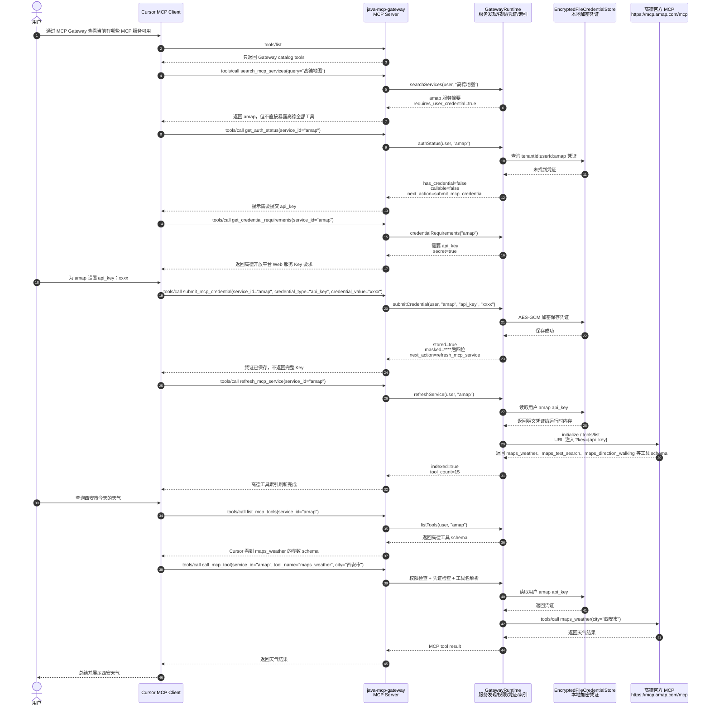

# Java MCP Gateway 阶段性交付说明

本文档面向 mentor/评审同学，目标是让对方可以在自己的电脑上快速理解、启动、配置 Cursor，并验证当前 MCP Gateway 已完成的核心链路。

当前目录是一个独立的 Java 17 Spring Boot 原型工程，位置：

```text
Unla/java-mcp-gateway
```

## 1. 当前完成的能力

当前版本重点验证 MCP Gateway 作为统一入口的可行性：

- Gateway 对 Cursor/Agent 表现为一个 MCP Server。
- Gateway 对下游 MCP 服务表现为 MCP Client/Router。
- Cursor 顶层只看到少量 Gateway catalog tools，不直接暴露所有下游 MCP tools。
- Gateway 支持 MCP 服务注册、服务发现、能力索引、权限检查、用户凭证检查和路由转发。
- 已接入高德官方远程 MCP，使用 Streamable HTTP 方式访问。
- 高德 Key 不再要求启动前 `export AMAP_MAPS_API_KEY`，而是由用户通过 Cursor/Gateway 工具提交。
- 用户凭证第一版使用本机 AES-GCM 加密文件存储。

核心调用链路：

```text
Cursor / Agent
  -> POST /mcp
  -> Java MCP Gateway
       -> Gateway catalog tools
       -> PermissionService
       -> CredentialStore
       -> CapabilityIndex
       -> StreamableHttpMcpClient / StdioMcpClient
  -> AMap / Fetch / Filesystem / Time / Mock Feishu MCP
```

## 2. 环境要求

### 必需环境

| 依赖 | 建议版本 | 用途 | 检查命令 |
| --- | --- | --- | --- |
| JDK | 17 | 编译和运行 Spring Boot | `java -version` |
| Maven | 3.8+ | 构建和测试 | `mvn -version` |
| Cursor | 支持 MCP 的版本 | 作为真实 MCP Client 验收 | Cursor Settings -> MCP |

### 可选环境(自行开发agent测试用，已弃用)

| 依赖 | 用途 | 检查命令 |
| --- | --- | --- |
| Python 3 | 运行 `agent/deepseek_agent.py` 和部分 stdio MCP 测试 | `python3 --version` |
| Node.js / npx | 启动 filesystem MCP stdio 服务 | `npx --version` |
| uv / uvx | 启动 fetch/time MCP stdio 服务 | `uvx --version` |

如果只验证 Gateway 编译、单元测试、Cursor 挂载和高德 MCP 链路，重点确保 JDK 17、Maven、Cursor 可用即可。

## 3. 快速启动

进入 Java 工程目录：

```bash
cd /Users/nikonzhang/shixi/mcp-gateway/Unla/java-mcp-gateway
```

运行全部测试：

```bash
mvn test
```

启动 Gateway，推荐使用固定端口 `8091` 方便 Cursor 配置：

```bash
mvn spring-boot:run \
  -Dspring-boot.run.profiles=real-mcp \
  -Dspring-boot.run.arguments=--server.port=8091
```

启动成功后，Gateway MCP endpoint 为：

```text
http://127.0.0.1:8091/mcp
```

健康检查：

```bash
curl -s http://127.0.0.1:8091/mcp \
  -H 'Content-Type: application/json' \
  -d '{"jsonrpc":"2.0","id":"init","method":"initialize","params":{}}'
```

预期能看到类似：

```json
{
  "jsonrpc": "2.0",
  "result": {
    "protocolVersion": "2025-03-26",
    "serverInfo": {
      "name": "java-mcp-gateway"
    },
    "capabilities": {
      "tools": {
        "listChanged": true
      }
    }
  },
  "id": "init"
}
```

运维状态检查：

```bash
curl -s http://127.0.0.1:8091/internal/status
```

Spring Actuator 健康检查：

```bash
curl -s http://127.0.0.1:8091/actuator/health
```

基础指标入口：

```bash
curl -s http://127.0.0.1:8091/actuator/metrics
```

## 4. Cursor 配置

在项目级 `.cursor/mcp.json` 或全局 `~/.cursor/mcp.json` 中添加：

```json
{
  "mcpServers": {
    "java-mcp-gateway": {
      "url": "http://127.0.0.1:8091/mcp"
    }
  }
}
```

建议项目级配置：

```bash
cd /Users/nikonzhang/shixi/mcp-gateway/Unla
mkdir -p .cursor
```

然后在 `.cursor/mcp.json` 中写入上面的 JSON。

配置后打开 Cursor：

1. 进入 Cursor Settings。
2. 打开 MCP 页面。
3. 找到 `java-mcp-gateway`。
4. 点击 Reload / 重新连接。
5. 确认状态为 connected。

如果 Gateway 重启过，Cursor 可能仍保留旧连接状态，需要在 Cursor MCP 页面重新 Reload。

## 5. Cursor 调用高德 MCP 流程图

下面这张图描述 Cursor 通过 `java-mcp-gateway` 调用高德 MCP 的完整链路。重点是：Cursor 只连接 Gateway，不直接连接高德；高德工具由 Gateway 按需发现和转发。



如果用户已经提交过高德 Key，并且 `refresh_mcp_service` 已成功执行过，后续 Cursor 可以跳过 `get_credential_requirements`、`submit_mcp_credential` 和 `refresh_mcp_service`，直接进入 `list_mcp_tools` 和 `call_mcp_tool`。

## 6. Cursor 能看到哪些工具

Cursor 顶层只应该看到 Gateway catalog tools：

| Tool | 作用 |
| --- | --- |
| `search_mcp_services` | 搜索当前可用 MCP 服务 |
| `describe_mcp_service` | 查看单个 MCP 服务详情 |
| `list_mcp_tools` | 按需查看某个下游 MCP 服务的工具 |
| `get_auth_status` | 查看某个服务当前是否可调用 |
| `get_credential_requirements` | 查看某个服务需要哪些凭证 |
| `submit_mcp_credential` | 提交当前用户对某个服务的凭证 |
| `delete_mcp_credential` | 删除当前用户对某个服务的凭证 |
| `refresh_mcp_service` | 提交凭证后刷新某个服务的工具索引 |
| `call_mcp_tool` | 调用某个下游 MCP 工具 |

高德的 `maps_weather`、`maps_text_search`、`maps_direction_walking` 等工具不会直接出现在 Cursor 顶层，而是通过：

```text
list_mcp_tools(service_id="amap")
```

按需展开。

这个设计是为了避免后续挂载几十或上百个 MCP 服务时，Agent 上下文被所有工具 schema 撑爆。

## 7. 高德 MCP 凭证配置

当前高德服务配置在：

```text
src/main/resources/application-real-mcp.yml
```

关键配置：

```yaml
- id: amap
  name: AMap MCP
  transport: streamable-http
  url: https://mcp.amap.com/mcp?key={api_key}
  requiresUserCredential: true
  credentialRequirements:
    - name: api_key
      description: 高德开放平台 Web 服务 Key
      secret: true
```

注意：

- 不需要在启动前 `export AMAP_MAPS_API_KEY`。
- 用户通过 Cursor 或 curl 调用 `submit_mcp_credential` 提交自己的高德 Key。
- Gateway 会把 `{api_key}` 替换成当前用户提交的 key，再请求高德官方 MCP。
- 凭证会保存到本机加密文件。

本地凭证文件：

```text
~/.mcp-gateway/credentials.enc
~/.mcp-gateway/master.key
```

这只是原型阶段方案。生产环境应替换为公司 Vault/KMS/统一凭证系统。

## 8. 命令行测试步骤

以下命令可以在不打开 Cursor 的情况下模拟 Cursor 调用 Gateway。

### 8.1 查看 Gateway 顶层工具

```bash
curl -s http://127.0.0.1:8091/mcp \
  -H 'Content-Type: application/json' \
  -H 'Authorization: Bearer alice' \
  -d '{"jsonrpc":"2.0","id":"tools","method":"tools/list","params":{}}'
```

验收点：

- 返回中应该包含 `search_mcp_services`、`list_mcp_tools`、`call_mcp_tool`。
- 不应该直接包含 `maps_weather`、`maps_geo`、`maps_direction_walking`。

### 8.2 发现当前 MCP 服务

```bash
curl -s http://127.0.0.1:8091/mcp \
  -H 'Content-Type: application/json' \
  -H 'Authorization: Bearer alice' \
  -d '{"jsonrpc":"2.0","id":"search","method":"tools/call","params":{"name":"search_mcp_services","arguments":{"query":""}}}'
```

验收点：

- 能看到 `amap`。
- 如果本机安装了对应 stdio 依赖，也可能看到 `fetch`、`filesystem`、`time`。
- `amap.requires_user_credential` 应为 `true`。

### 8.3 查看高德需要什么凭证

```bash
curl -s http://127.0.0.1:8091/mcp \
  -H 'Content-Type: application/json' \
  -H 'Authorization: Bearer alice' \
  -d '{"jsonrpc":"2.0","id":"requirements","method":"tools/call","params":{"name":"get_credential_requirements","arguments":{"service_id":"amap"}}}'
```

验收点：

```json
{
  "service_id": "amap",
  "requirements": [
    {
      "name": "api_key",
      "description": "高德开放平台 Web 服务 Key",
      "secret": true
    }
  ]
}
```

### 8.4 提交高德 Key

把下面命令里的 `你的高德Key` 换成真实高德开放平台 Web 服务 Key：

```bash
curl -s http://127.0.0.1:8091/mcp \
  -H 'Content-Type: application/json' \
  -H 'Authorization: Bearer alice' \
  -d '{"jsonrpc":"2.0","id":"submit","method":"tools/call","params":{"name":"submit_mcp_credential","arguments":{"service_id":"amap","credential_type":"api_key","credential_value":"你的高德Key"}}}'
```

验收点：

- 返回 `stored:true`。
- 返回中只应该出现脱敏值，例如 `****c43b`，不应该打印完整 Key。

### 8.5 刷新高德工具索引

```bash
curl -s http://127.0.0.1:8091/mcp \
  -H 'Content-Type: application/json' \
  -H 'Authorization: Bearer alice' \
  -d '{"jsonrpc":"2.0","id":"refresh","method":"tools/call","params":{"name":"refresh_mcp_service","arguments":{"service_id":"amap"}}}'
```

验收点：

- 返回 `indexed:true`。
- 返回 `tool_count`，高德当前通常是 15 个工具。

### 8.6 查看高德工具列表

```bash
curl -s http://127.0.0.1:8091/mcp \
  -H 'Content-Type: application/json' \
  -H 'Authorization: Bearer alice' \
  -d '{"jsonrpc":"2.0","id":"list-amap","method":"tools/call","params":{"name":"list_mcp_tools","arguments":{"service_id":"amap"}}}'
```

验收点：

- 返回中应包含 `maps_weather`。
- 返回中应包含 `maps_text_search`。
- 返回中应包含 `maps_direction_walking`。
- 每个工具应包含完整 `inputSchema`，供 Cursor/Agent 准确构造参数。

### 8.7 调用高德天气

```bash
curl -s http://127.0.0.1:8091/mcp \
  -H 'Content-Type: application/json' \
  -H 'Authorization: Bearer alice' \
  -d '{"jsonrpc":"2.0","id":"weather","method":"tools/call","params":{"name":"call_mcp_tool","arguments":{"service_id":"amap","tool_name":"maps_weather","city":"西安市"}}}'
```

验收点：

- 返回高德天气结果。
- 如果返回 `auth_required`，说明还没有提交高德 Key。
- 如果返回 `service_not_indexed`，说明提交 Key 后还没有调用 `refresh_mcp_service`。

### 8.8 删除高德凭证

```bash
curl -s http://127.0.0.1:8091/mcp \
  -H 'Content-Type: application/json' \
  -H 'Authorization: Bearer alice' \
  -d '{"jsonrpc":"2.0","id":"delete","method":"tools/call","params":{"name":"delete_mcp_credential","arguments":{"service_id":"amap"}}}'
```

验收点：

- 返回 `deleted:true`。
- 再调用 `get_auth_status` 时，`has_credential` 应回到 `false`。

## 9. 可维护、可观测、可测试入口

为了满足“可维可测”要求，当前版本新增了专门的运行状态接口和 Spring Actuator 健康/指标入口。

### 9.1 Gateway 运行状态

```bash
curl -s http://127.0.0.1:8091/internal/status
```

返回内容包含：

| 字段 | 说明 |
| --- | --- |
| `service_count` | 当前注册的 MCP 服务数量 |
| `indexed_count` | 已完成工具索引的服务数量 |
| `auth_required_count` | 等待用户提交凭证的服务数量 |
| `unavailable_count` | 下游初始化或索引失败的服务数量 |
| `catalog_tool_count` | Gateway 顶层 catalog tools 数量 |
| `services` | 每个 MCP 服务的状态明细 |

单个服务状态包含：

```json
{
  "id": "amap",
  "name": "AMap MCP",
  "transport": "streamable-http",
  "requires_user_credential": true,
  "available": true,
  "indexed": false,
  "tool_count": 0,
  "last_error": "auth_required",
  "last_synced_at": "",
  "state": "auth_required"
}
```

这个接口不返回任何用户凭证明文，可以给 mentor 或后续运维同学直接看 Gateway 当前状态。

### 9.2 Actuator 健康检查

```bash
curl -s http://127.0.0.1:8091/actuator/health
```

健康检查中包含自定义 `mcpGateway` 组件：

| 字段 | 说明 |
| --- | --- |
| `service_count` | Gateway 当前服务数量 |
| `indexed_count` | 已索引服务数量 |
| `auth_required_count` | 需要用户凭证的服务数量 |
| `unavailable_count` | 不可用服务数量 |

状态规则：

- `UP`：Gateway 正常，且没有下游服务处于不可用。
- `DEGRADED`：Gateway 进程可用，但存在下游服务索引失败或不可用。
- `OUT_OF_SERVICE`：Gateway 没有注册任何 MCP 服务。

### 9.3 Actuator 指标入口

```bash
curl -s http://127.0.0.1:8091/actuator/metrics
```

常用指标示例：

```bash
curl -s http://127.0.0.1:8091/actuator/metrics/http.server.requests
```

该指标可用于观察 `/mcp`、`/internal/status`、`/actuator/health` 等 HTTP 请求的次数、耗时和状态码分布。当前阶段先接入 Spring Boot 默认指标，后续可以继续增加按 `service_id`、`tool_name` 维度的业务指标。

### 9.4 可测试性

所有可维可测入口都有集成测试覆盖：

- `/internal/status` 返回服务状态，且不包含凭证明文。
- `/actuator/health` 包含 `mcpGateway` 组件和服务数量明细。
- `mvn test` 会一起验证这些接口。

## 10. Cursor 测试话术

Gateway 启动并在 Cursor 中 connected 后，可以直接让 Cursor 执行：

```text
通过 MCP Gateway 查看当前有哪些 MCP 服务可用
```

预期：

- Cursor 调用 `search_mcp_services`。
- 能看到 `amap`。
- 如果高德 Key 未提交，应提示需要 `api_key`。

然后继续：

```text
高德地图 MCP 需要什么凭证？
```

预期：

- Cursor 调用 `get_credential_requirements(service_id="amap")`。
- 返回高德需要 `api_key`。

提交凭证：

```text
为 amap 设置 api_key：你的高德Key
```

预期：

- Cursor 调用 `submit_mcp_credential`。
- 然后调用或提示调用 `refresh_mcp_service`。

查询天气：

```text
请你通过高德地图查询西安市今天的天气
```

预期调用链：

```text
search_mcp_services(query="高德地图")
get_auth_status(service_id="amap")
list_mcp_tools(service_id="amap")
call_mcp_tool(service_id="amap", tool_name="maps_weather", city="西安市")
```

路线规划：

```text
请你通过高德地图，查询从西安市雁塔区南洋时代到曲江汉华国际中心的步行路线
```

预期调用链：

```text
maps_text_search
maps_search_detail
maps_direction_walking
```

## 11. Python Agent 测试

当前主要验收对象是 Cursor，但仓库中仍保留 Python agent demo。

确定性 scripted 模式，不需要 DeepSeek Key：

```bash
python3 agent/deepseek_agent.py --scripted \
  --gateway http://127.0.0.1:8091/mcp \
  --task "fetch https://example.com"
```

DeepSeek 模式需要本地 shell 设置：

```bash
export DEEPSEEK_API_KEY="你的 DeepSeek Key"

python3 agent/deepseek_agent.py --deepseek \
  --gateway http://127.0.0.1:8091/mcp \
  --task "查询北京今天的天气，使用高德地图 MCP"
```

注意不要把 DeepSeek Key 写入仓库、README 或提交记录。

## 12. 已接入服务

`real-mcp` profile 下的服务配置来自：

```text
src/main/resources/application-real-mcp.yml
```

| Service ID | 类型 | 说明 |
| --- | --- | --- |
| `amap` | Streamable HTTP | 高德官方远程 MCP，需用户提交 `api_key` |
| `fetch` | stdio | 抓取公网网页内容，依赖 `uvx mcp-server-fetch` |
| `filesystem` | stdio | 读写 `./sandbox` 目录，依赖 `npx @modelcontextprotocol/server-filesystem` |
| `time` | stdio | 查询当前时间和时区转换，依赖 `uvx mcp-server-time` |
| `feishu` | HTTP mock | 本地 Mock 飞书 MCP，用于验证转发和权限模型 |
| `github` | stdio | 当前配置为 `enabled:false`，暂不参与验收 |

## 13. 关键源码位置

| 文件 | 说明 |
| --- | --- |
| `src/main/java/com/example/mcpgateway/McpGatewayController.java` | HTTP `/mcp` 入口 |
| `src/main/java/com/example/mcpgateway/GatewayStatusController.java` | `/internal/status` 运维状态入口 |
| `src/main/java/com/example/mcpgateway/McpGatewayHealthIndicator.java` | Actuator 自定义健康检查 |
| `src/main/java/com/example/mcpgateway/McpJsonRpcHandler.java` | MCP JSON-RPC 方法分发 |
| `src/main/java/com/example/mcpgateway/GatewayRuntime.java` | 服务发现、权限、凭证、路由核心逻辑 |
| `src/main/java/com/example/mcpgateway/CapabilityIndex.java` | 下游 MCP 工具能力索引 |
| `src/main/java/com/example/mcpgateway/StreamableHttpMcpClient.java` | 远程 HTTP MCP client |
| `src/main/java/com/example/mcpgateway/mcp/StdioMcpClient.java` | 本地 stdio MCP client |
| `src/main/java/com/example/mcpgateway/EncryptedFileCredentialStore.java` | 本地加密凭证存储 |
| `src/main/resources/application-real-mcp.yml` | 真实 MCP 服务配置 |

## 14. 测试覆盖

运行：

```bash
mvn test
```

当前测试覆盖：

- Gateway 顶层 `tools/list` 只暴露 catalog tools。
- 服务发现能返回注册服务。
- 高德无凭证时返回明确认证状态。
- `get_credential_requirements` 能返回高德 `api_key` 要求。
- `submit_mcp_credential` 能写入用户凭证。
- `delete_mcp_credential` 能删除用户凭证。
- 加密凭证文件重建 store 后仍能读取。
- 加密文件不包含明文凭证。
- `StreamableHttpMcpClient` 能把 `{api_key}` 注入高德 endpoint。
- Gateway 能通过 HTTP MCP client 转发到 mock Feishu。
- 权限不足时能拒绝调用。
- `/internal/status` 能返回服务状态并避免泄漏凭证明文。
- `/actuator/health` 能返回 Gateway 自定义健康检查明细。

## 15. 常见问题

### Cursor 显示 `Not connected`

通常是 Gateway 重启后 Cursor 还保留旧连接。处理方式：

1. 确认 Gateway 进程仍在运行。
2. 用 curl 调 `initialize` 检查 `/mcp` 是否可用。
3. 在 Cursor Settings -> MCP 中 Reload `java-mcp-gateway`。

### 高德服务能发现，但 `tool_count` 是 0

这是正常的未授权状态。因为高德需要用户 Key，Gateway 不会在启动时用空 Key 拉取工具。

处理步骤：

```text
get_credential_requirements
submit_mcp_credential
refresh_mcp_service
list_mcp_tools
```

### 调用高德时返回 `auth_required`

当前用户没有提交高德 `api_key`，或者凭证被删除。重新调用 `submit_mcp_credential`。

### 调用高德时返回 `service_not_indexed`

已经提交凭证，但还没有刷新工具索引。调用：

```text
refresh_mcp_service(service_id="amap")
```

### Cursor 为什么不能直接看到 `maps_weather`

这是设计目标。Cursor 顶层只挂 Gateway catalog tools，避免所有下游 MCP tools 一次性进入上下文。Agent 需要先发现服务，再按需展开某个服务的工具。

## 16. 当前边界

当前版本是阶段性原型，不是生产网关。还未完成：

- OAuth、二维码、短信验证码等交互式授权流。
- 多租户生产级权限系统。
- Vault/KMS/公司凭证服务接入。
- 高并发连接池、限流、熔断、重试。
- 按 `service_id`、`tool_name` 细分的业务指标。
- Streamable HTTP event-stream 分片解析增强。
- MCP session header 生命周期管理。
- 管理端 UI 和控制面配置下发。

## 17. 更多中文文档

- [USER_CREDENTIAL_FLOW.zh-CN.md](USER_CREDENTIAL_FLOW.zh-CN.md)：用户凭证提交与本地加密存储设计。
- [CURSOR_GATEWAY_VALIDATION.zh-CN.md](CURSOR_GATEWAY_VALIDATION.zh-CN.md)：Cursor 挂载 Gateway 的详细验收路线。
- [STAGE_SUMMARY_CURSOR_AMAP.zh-CN.md](STAGE_SUMMARY_CURSOR_AMAP.zh-CN.md)：当前阶段结构设计、调用方式、不足和后续改进。
- [CODE_WALKTHROUGH.zh-CN.md](CODE_WALKTHROUGH.zh-CN.md)：核心代码阅读说明。
- [AMAP_REAL_MCP_VALIDATION.zh-CN.md](AMAP_REAL_MCP_VALIDATION.zh-CN.md)：高德真实远程 MCP 接入说明。
