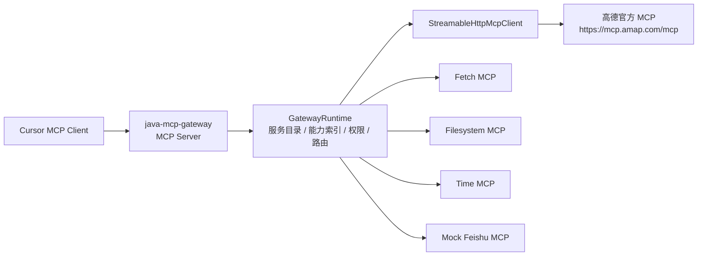

# MCP Gateway 阶段性总结：Cursor 挂载与高德 MCP 验证

本文总结当前 `java-mcp-gateway` 阶段成果：让 Cursor 作为真实 MCP Client 挂载本地 MCP Gateway，并通过 Gateway 发现和调用高德地图官方 MCP 服务。

## 1. 阶段目标

本阶段目标已经从“自写 DeepSeek agent 验证链路”调整为：

```text
Cursor -> java-mcp-gateway -> 下游 MCP 服务
```

其中 Cursor 只挂载 `java-mcp-gateway`，不直接挂载高德、Fetch、Filesystem、Time 等下游 MCP。Gateway 负责：

- 发现当前有哪些 MCP 服务可用。
- 只向 Cursor 暴露少量 catalog tools，避免大量下游 tools 直接进入上下文。
- 按需返回某个下游 MCP 的完整工具 schema。
- 将 Cursor 的工具调用转发到真实下游 MCP。
- 预留用户权限、凭证、服务健康状态等治理能力。

当前阶段重点不是完成生产级网关，而是证明“Cursor 能把 Gateway 当作 MCP Server 使用，并通过 Gateway 发现和调用高德 MCP”。

## 2. 当前整体结构



Gateway 在这个架构中有双重身份：

- 对 Cursor 来说，它是一个 MCP Server。
- 对下游 MCP 来说，它是一个 MCP Client / Router。

这种结构保留了后续接入上百个 MCP 服务时的治理空间：Cursor 不需要直接挂载所有 MCP，只需要挂载 Gateway。

## 3. Cursor 侧挂载方式

Cursor 配置文件可以放在项目级：

```text
/Users/nikonzhang/shixi/mcp-gateway/Unla/.cursor/mcp.json
```

也可以放在全局：

```text
~/.cursor/mcp.json
```

当前配置为：

```json
{
  "mcpServers": {
    "java-mcp-gateway": {
      "url": "http://127.0.0.1:8091/mcp"
    }
  }
}
```

Gateway 启动命令：

```bash
cd /Users/nikonzhang/shixi/mcp-gateway/Unla/java-mcp-gateway

export AMAP_MAPS_API_KEY="你的高德 Key"

mvn spring-boot:run \
  -Dspring-boot.run.profiles=real-mcp \
  -Dspring-boot.run.arguments=--server.port=8091
```

高德 Key 不写入仓库，只通过环境变量注入：

```yaml
url: https://mcp.amap.com/mcp?key=${AMAP_MAPS_API_KEY:}
```

## 4. Gateway 暴露给 Cursor 的工具

Cursor 顶层只会看到 Gateway catalog tools：

| Tool | 作用 |
| --- | --- |
| `search_mcp_services` | 搜索当前用户可发现的 MCP 服务 |
| `describe_mcp_service` | 查看单个 MCP 服务摘要 |
| `list_mcp_tools` | 按需查看某个 MCP 服务的完整工具列表 |
| `get_auth_status` | 查询某个服务是否需要用户凭证、当前是否可调用 |
| `call_mcp_tool` | 调用某个下游 MCP 的具体工具 |

这个设计的核心目的是控制上下文规模。即使后续有 100 个 MCP 服务、上千个工具，Cursor 顶层仍只挂载少量 Gateway tools。

下游 MCP 的真实工具，例如高德的 `maps_weather`、`maps_geo`、`maps_direction_walking`，不会直接出现在 Cursor 顶层工具列表中，而是通过：

```text
list_mcp_tools(service_id="amap")
```

按需展开。

## 5. 当前已接入的 MCP 服务

Cursor 通过 Gateway 查询到当前可用服务：

| ID | 名称 | 工具数 | 需凭证 | 说明 |
| --- | --- | ---: | --- | --- |
| `amap` | AMap MCP | 15 | 否 | 高德地图：POI、天气、路线、距离测算等 |
| `feishu` | Feishu MCP | 2 | 是 | 本地 Mock 飞书服务，用于验证 |
| `fetch` | Fetch MCP | 1 | 否 | 抓取公网网页内容 |
| `filesystem` | Filesystem MCP | 14 | 否 | 读取网关沙箱内本地文件 |
| `time` | Time MCP | 2 | 否 | 当前时间与时区转换 |

配置里保留了 GitHub MCP，但当前 `enabled: false`，不会出现在可用服务列表。

## 6. 高德 MCP 调用链路

### 6.1 服务发现

Cursor 提问：

```text
当前可用的mcp服务有哪些
```

理想调用：

```text
search_mcp_services(query="")
```

Gateway 返回结构化 JSON，包含：

- `id`
- `name`
- `description`
- `tags`
- `tool_count`
- `available`
- `requires_user_credential`
- `recommended_tools`

这比早期的 `ServiceSummary[...]` 字符串更适合模型读取和后续决策。

### 6.2 工具发现

Cursor 提问：

```text
使用高德地图 MCP 查询北京今天的天气
```

理想调用：

```text
search_mcp_services(query="高德地图")
list_mcp_tools(service_id="amap")
call_mcp_tool(service_id="amap", tool_name="maps_weather", city="北京")
```

`list_mcp_tools` 返回高德 15 个工具，并保留完整 JSON Schema，例如：

```json
{
  "name": "maps_weather",
  "description": "根据城市名称或者标准adcode查询指定城市的天气",
  "inputSchema": {
    "type": "object",
    "properties": {
      "city": {
        "type": "string",
        "description": "城市名称或者adcode"
      }
    },
    "required": ["city"]
  }
}
```

这解决了早期“模型看到工具名但参数信息不完整，只能靠猜”的问题。

### 6.3 路由转发

Cursor 最终调用 Gateway catalog tool：

```json
{
  "service_id": "amap",
  "tool_name": "maps_weather",
  "city": "北京"
}
```

Gateway 内部执行：

```text
call_mcp_tool
  -> GatewayRuntime.callTool
  -> 权限检查
  -> 凭证检查
  -> StreamableHttpMcpClient.callTool
  -> POST https://mcp.amap.com/mcp?key=...
  -> 高德 MCP tools/call
  -> 返回天气结果
```

## 7. Cursor 实测结果

### 7.1 西安天气查询

Cursor 已能通过 Gateway 调用高德地图 MCP 查询西安天气。这证明：

- Cursor 已成功挂载 Gateway。
- Cursor 能使用 Gateway catalog tools。
- Gateway 能发现 `amap` 服务。
- Gateway 能转发到高德官方 MCP。

### 7.2 西安步行路线规划

Cursor 已能完成复杂多步调用：

用户问题：

```text
请你通过高德地图，查询一下从西安市雁塔区南洋时代到曲江汉化国际中心的步行路线
```

实际调用链路：

```text
maps_text_search
  -> maps_search_detail
  -> maps_direction_walking
```

Cursor 能先做 POI 匹配，再用匹配到的坐标调用步行路线规划。最终返回：

- 起点匹配：`交大南洋时代B座`
- 终点匹配：`汉华曲江中心`
- 距离：约 `1547` 米
- 时间：约 `1238` 秒
- 分段步行指引

这说明 Gateway 不只是能跑单工具调用，也能支撑 Cursor 使用同一个下游 MCP 完成多工具组合任务。

### 7.3 服务发现

Cursor 已能通过 Gateway 查询当前所有可用 MCP 服务，并正确展示：

- `amap`
- `feishu`
- `fetch`
- `filesystem`
- `time`

其中 `amap` 已正常索引 15 个工具。

## 8. 核心代码模块

### `McpJsonRpcHandler`

位置：

```text
java-mcp-gateway/src/main/java/com/example/mcpgateway/McpJsonRpcHandler.java
```

职责：

- 处理 Cursor 发来的 JSON-RPC 请求。
- 响应 `initialize`、`tools/list`、`tools/call`。
- 只在顶层暴露 Gateway catalog tools。
- 将 `search_mcp_services`、`list_mcp_tools` 等 catalog tools 转换为结构化 JSON 文本。
- 兼容 `notifications/initialized`。

### `GatewayRuntime`

位置：

```text
java-mcp-gateway/src/main/java/com/example/mcpgateway/GatewayRuntime.java
```

职责：

- 维护服务注册表。
- 维护能力索引。
- 执行服务发现。
- 执行权限和凭证检查。
- 将调用路由给对应下游 MCP client。
- 对工具名做基础 canonicalization，例如 `weather` 可唯一映射到 `maps_weather`。

### `ToolSchema`

位置：

```text
java-mcp-gateway/src/main/java/com/example/mcpgateway/ToolSchema.java
```

职责：

- 保存工具名、描述和完整 `inputSchema`。
- 兼容旧的简化 schema 写法。
- 为 Cursor/模型提供足够完整的工具参数信息。

### `StreamableHttpMcpClient`

位置：

```text
java-mcp-gateway/src/main/java/com/example/mcpgateway/StreamableHttpMcpClient.java
```

职责：

- 作为 Gateway 到远程 MCP 的 HTTP client。
- 调用远程 `initialize`。
- 调用远程 `tools/list` 建立能力索引。
- 调用远程 `tools/call` 执行工具调用。
- 当前已验证高德官方 MCP。

### `GatewayConfiguration`

位置：

```text
java-mcp-gateway/src/main/java/com/example/mcpgateway/GatewayConfiguration.java
```

职责：

- 根据配置注册下游 MCP 服务。
- 支持 `stdio` 和 `streamable-http` 两类 transport。
- 默认注册本地 Feishu mock，并加载 `application-real-mcp.yml` 中的真实服务。

## 9. 当前设计价值

### 9.1 避免工具爆炸

Cursor 顶层只看到 5 个 Gateway catalog tools，而不是直接看到所有下游 MCP tools。后续即使接入更多服务，也可以保持顶层工具数量稳定。

### 9.2 支持按需发现

服务发现和工具发现被拆成两步：

```text
search_mcp_services -> list_mcp_tools
```

这让 Agent/Cursor 可以先根据任务选择服务，再展开具体工具。

### 9.3 保留治理能力

Gateway 位于 Cursor 和下游 MCP 中间，因此后续可以统一加：

- 权限控制
- 凭证注入
- 服务健康检查
- 审计日志
- 限流熔断
- 多租户隔离

### 9.4 已验证真实远程 MCP

高德 MCP 是真实远程 Streamable HTTP MCP 服务，不是 mock。这证明 Gateway 的远程路由方向是可行的。

## 10. 当前不足

### 10.1 Streamable HTTP 支持还不完整

当前 `StreamableHttpMcpClient` 能处理高德这种 JSON 响应型 MCP，但还没有完整实现：

- event-stream 分片解析。
- MCP session header 管理。
- 长连接/流式响应处理。
- 断线恢复。

生产级需要完整适配 MCP Streamable HTTP 规范。

### 10.2 服务可用状态还比较粗

当前 `available` 主要表示服务已注册且能力索引未记录错误。未来应该拆成更清楚的状态：

- `registered`
- `reachable`
- `indexed`
- `healthy`
- `last_error`
- `last_synced_at`

例如之前遇到过 Key 未注入时 `amap` 注册存在但工具数为 0 的情况，生产中需要更明确地暴露给 Cursor/用户。

### 10.3 权限和凭证仍是原型

当前用户、权限、凭证仍然是内存实现：

- `UserContext`
- `PermissionService`
- `CredentialStore`

生产中应对接公司 Agent runtime / IAM / OAuth / Vault / KMS。

### 10.4 工具检索仍偏规则化

当前服务发现支持中文复合词和简单多词匹配，但还不是语义检索。后续接入上百个 MCP 后，需要引入：

- embedding 检索
- rerank
- tool/service alias
- usage examples
- task-to-tool intent mapping

### 10.5 工具调用参数未做强校验

当前 Gateway 基本把参数透传给下游 MCP。未来应基于 `inputSchema` 做：

- 必填字段校验
- 类型校验
- 默认值填充
- 参数别名归一化
- 更友好的错误提示

### 10.6 缺少观测与审计

当前没有完整记录：

- 哪个用户调用了哪个服务。
- 哪个 Agent 调用了哪个工具。
- 下游耗时、失败率、错误码。
- token / context 使用情况。

生产中这些信息对排障、计费、权限审计都很重要。

## 11. 下一阶段建议

### 阶段 A：协议补全

目标：让 Gateway 更标准地支持 Cursor 和其他 MCP Client。

任务：

- 完整实现 Streamable HTTP session。
- 支持 event-stream 响应解析。
- 规范 JSON-RPC error code。
- 增加 MCP 初始化和通知兼容测试。

### 阶段 B：服务目录治理

目标：让服务发现从“可用原型”升级为“可治理目录”。

任务：

- 为服务增加状态字段：`registered/reachable/indexed/healthy`。
- 增加定时能力刷新。
- 增加服务健康检查接口。
- 支持服务启停和动态配置。

### 阶段 C：权限与凭证

目标：让 Gateway 能进入公司实际 Agent runtime。

任务：

- 对接公司用户身份。
- 对接权限系统。
- 设计服务级、工具级、参数级权限。
- 将 Key/OAuth token 从 URL query 迁移到凭证注入模块。

### 阶段 D：工具选择增强

目标：降低 Cursor/Agent 选错服务或工具的概率。

任务：

- 保存工具完整 schema、examples、tags、aliases。
- 对服务和工具建立语义索引。
- 为 `search_mcp_services` 返回更高质量的 `recommended_tools`。
- 对 `call_mcp_tool` 做 schema 校验和错误纠正。

### 阶段 E：生产能力

目标：高并发、高可用。

任务：

- HTTP 连接池。
- 超时、重试、熔断。
- 限流和隔离。
- 指标监控。
- 日志审计。
- 多实例部署和无状态化。

## 12. 当前阶段结论

当前阶段已经达成关键目标：

```text
Cursor 可以挂载 java-mcp-gateway，
并通过 Gateway 发现和调用高德官方 MCP。
```

更重要的是，Gateway 的设计边界已经比前一阶段清晰：

- Cursor/Agent 负责理解用户意图和选择调用路径。
- Gateway 负责服务目录、能力索引、权限预留、凭证预留和路由转发。
- 下游 MCP 保持原始能力，由 Gateway 做统一接入和治理。

这说明项目已经从“能不能调用 MCP”推进到了“如何把 MCP 服务治理后提供给真实 Agent/IDE 使用”的阶段。
